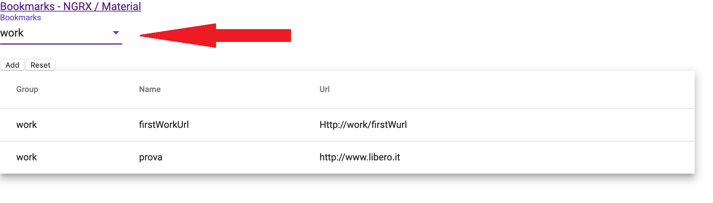
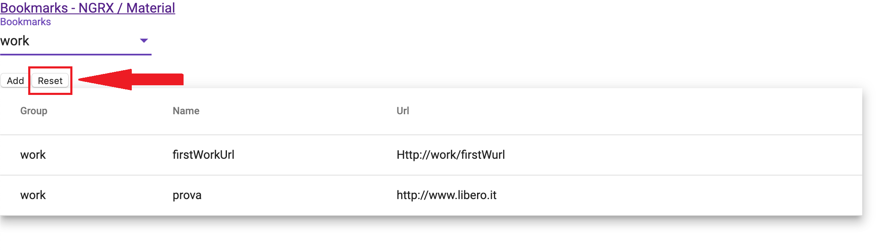
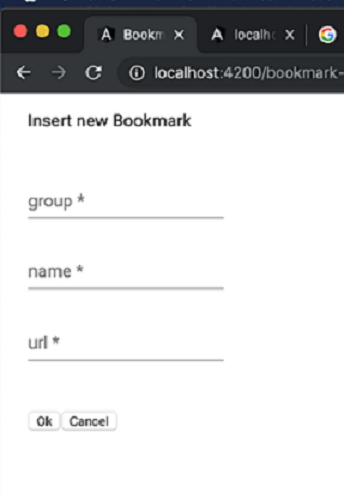

# BookmarkPrg

* This project was generated with 
  * [Angular CLI](https://github.com/angular/angular-cli) version 8.3.20;
  * NGRX for managing the state;
  * Angular material for the user interface;

 * Define the store for the application. Each bookmark should have the following properties:
   * Name
   * URL
   * Group (work / leisure/ personal / ...)
 
 * BookmarkPrg use an user inteface for displaying the bookmarks groupped by the "group" property.
 
 * BookmarkPrg provides the following features:
   * Add new bookmarks using a form
   * Delete bookmarks by "Double-clicking" in the list
  
## User Guide

* Navigating to `http://localhost:4200/` the user can see the main page 
 

* when the user chooses the bookmark group, all the entries of the selected group will be shown.
  

* When the user clicks the Reset button, the application will create default records
  

* the user can delete entries, simply by double clicking on the bookmark on the grid

* the user can add new bookmark entry, simply by clicking on "Add" button.
  

* The user can use the details form to enter a new bookmark entry.
  

## Development server

Run `ng serve` for a dev server. Navigate to `http://localhost:4200/`. The app will automatically reload if you change any of the source files.

## Code scaffolding

Run `ng generate component component-name` to generate a new component. You can also use `ng generate directive|pipe|service|class|guard|interface|enum|module`.

## Build

Run `ng build` to build the project. The build artifacts will be stored in the `dist/` directory. Use the `--prod` flag for a production build.

## Running unit tests

Run `ng test` to execute the unit tests via [Karma](https://karma-runner.github.io).

## Running end-to-end tests

Run `ng e2e` to execute the end-to-end tests via [Protractor](http://www.protractortest.org/).

## Further help

To get more help on the Angular CLI use `ng help` or go check out the [Angular CLI README](https://github.com/angular/angular-cli/blob/master/README.md).
